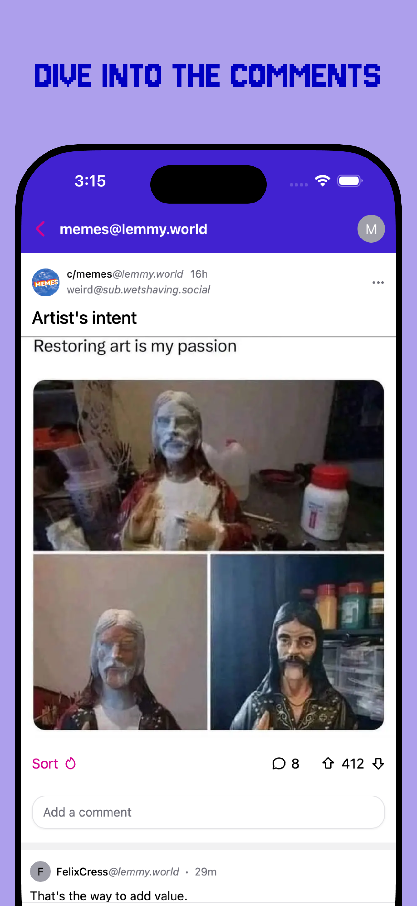
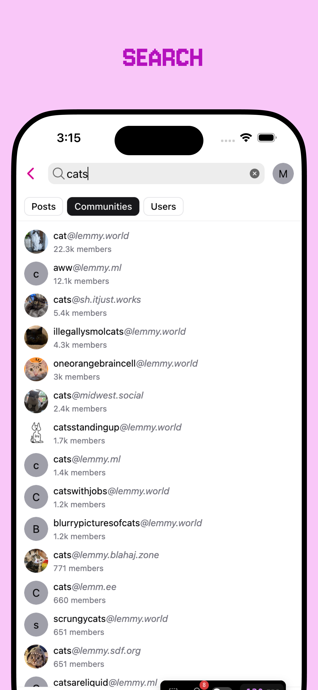
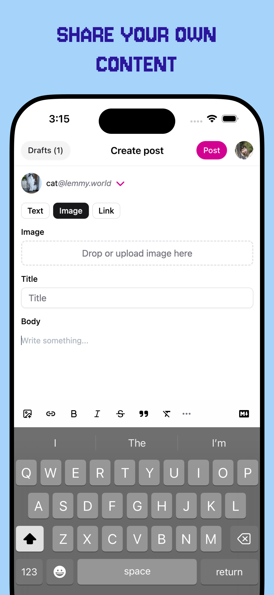

<p align="center">
  <a href="https://blorpblorp.xyz/" target="_blank" rel="noopener noreferrer">
    
  </a>
</p>

---

<p align="center">
<a href="https://blorpblorp.xyz/" target="_blank" rel="noopener noreferrer">Web App</a> · <a href="https://github.com/Blorp-Labs/blorp/issues/new?assignees=&labels=bug&projects=&template=bug_report.md&title=">Report Bug</a> · <a href="https://github.com/Blorp-Labs/blorp/issues/new?assignees=&labels=enhancement&projects=&template=feature_request.md&title=">Request Feature</a> · <a href="https://github.com/Blorp-Labs/blorp/releases">Releases</a>
</p>

<p align="center">
&nbsp;<a href="https://apps.apple.com/us/app/blorp-for-lemmy/id6739925430"></a>&nbsp;
&nbsp;<a href="https://play.google.com/store/apps/details?id=xyz.blorpblorp.app"></a>&nbsp;
&nbsp;<a href="https://f-droid.org/en/packages/xyz.blorpblorp.app/"></a>&nbsp;
</p>
<p align="center">
  <a href="https://matrix.to/#/#blorp:matrix.org"></a>
</p>
<br/>

<p align="center">
 &nbsp;&nbsp;
 &nbsp;&nbsp;
 &nbsp;&nbsp;
 &nbsp;&nbsp;
 &nbsp;&nbsp;
</p>
<br/>

## 🚀 Download

- [Web - blorpblorp.xyz](https://blorpblorp.xyz)
- [iOS](https://apps.apple.com/us/app/blorp-for-lemmy/id6739925430)
- Android
  - [Google Play](https://play.google.com/store/apps/details?id=xyz.blorpblorp.app)
  - [F-Droid](https://f-droid.org/en/packages/xyz.blorpblorp.app/)
- [macOS](https://github.com/Blorp-Labs/blorp/releases/latest)

## 🧪 Beta Testing

- [Join iOS TestFlight Beta](https://testflight.apple.com/join/T2pYyShr)
- [Join Google Play Beta](https://play.google.com/apps/testing/xyz.blorpblorp.app)

## ❤️ Friends of Blorp

| Url                                              | Lemmy | PieFed | Version                                                                                                                                     |
| ------------------------------------------------ | ----- | ------ | ------------------------------------------------------------------------------------------------------------------------------------------- |
| [blorp.lemmy.world](https://blorp.lemmy.world)   | ✅    | ✅     |   |
| [blorp.piefed.world](https://blorp.piefed.world) | ✅    | ✅     |  |
| [blorp.lemmy.zip](https://blorp.lemmy.zip)       | ✅    |        |     |
| [blorp.piefed.zip](https://blorp.piefed.zip)     |       | ✅     |    |
| [b.feddit.uk](https://b.feddit.uk)               | ✅    |        |         |
| [blorp.europe.pub](https://blorp.europe.pub)     | ✅    |        |    |
| [b.lemmy.nz](https://b.lemmy.nz/)                | ✅    | ✅     |          |
| [b.lazysoci.al](https://b.lazysoci.al)           | ✅    |        |       |
| [blorp.blahaj.zone](https://blorp.blahaj.zone)   | ✅    | ✅     |   |
| [blorp.lemmy.ca](https://blorp.lemmy.ca)         | ✅    | ✅     |      |
| [blorp.piefed.ca](https://blorp.piefed.ca)       | ✅    | ✅     |     |
| [b.lemmy.pt](https://b.lemmy.pt)                 | ✅    |        |          |
| [b.piefed.social](https://b.piefed.social)       |       | ✅     |     |
| [blorp.feddit.in](https://blorp.feddit.in)       | ✅    |        |     |
| [blorp.piefeed.com](https://blorp.piefeed.com)   |       | ✅     |   |

## 🛠 Development

### Prerequisites

**Node.js + pnpm** — Node.js 20+ recommended. pnpm is managed via corepack (bundled with Node.js):

```bash
corepack enable
pnpm install
```

**iOS (macOS only)** — CocoaPods is managed via Bundler so the version is pinned:

```bash
bundle install          # installs CocoaPods + Fastlane from Gemfile
bundle exec pod install --repo-update
open ios/App/App.xcworkspace   # always open .xcworkspace, not .xcodeproj
```

> Ruby 3.3 is required. If you have multiple Ruby versions, make sure `ruby --version` reports 3.3.x before running `bundle install`. With Homebrew: `brew install ruby@3.3` and follow the PATH instructions it prints.

### Common commands

| Command          | Purpose                                       |
| ---------------- | --------------------------------------------- |
| `pnpm dev`       | Start Vite dev server                         |
| `pnpm build`     | Production build (Vite + Capacitor sync)      |
| `pnpm test`      | Run Vitest unit tests                         |
| `pnpm test:ts`   | TypeScript type check                         |
| `pnpm lint`      | Lint via oxlint                               |
| `pnpm test:e2e`  | Playwright E2E tests (run `pnpm build` first) |
| `pnpm storybook` | Component Storybook                           |

## 🐳 Self host via Docker

_Recommended: use the [Blorp deployment configuration tool](https://deploy.blorpblorp.xyz/)_

```bash
# pull the latest Blorp image
docker pull ghcr.io/blorp-labs/blorp:latest

# run it on port 8080 (host → container), passing any runtime env‑vars you need
docker run -d \
  --name blorp \
  -p 8080:80 \
  -e REACT_APP_NAME="Blorp" \
  -e REACT_APP_DEFAULT_INSTANCE="https://lemmy.world,https://piefed.zip" \
  -e REACT_APP_LOCK_TO_DEFAULT_INSTANCE="1" \
  -e REACT_APP_INSTANCE_SELECTION_MODE="default_first"
  ghcr.io/blorp-labs/blorp:latest
```

## 💬 Blorp Community

Want to ask questions, share feedback, or just chat with other Blorp users? Head over to our community at  
[lemmy.zip/c/blorp](https://lemmy.zip/c/blorp).

## ❤️ Special thanks to

- [Lay](https://bsky.app/profile/awfukellay.bsky.social) for designing the logo and banner art.
- The PieFed team for their support and quickly resolving any and all feedback I brought them.

## 📚 Stack

- [React](https://react.dev/) – The library for web and native user interfaces
- [Ionic/Capacitor](https://ionicframework.com/docs/) – An open source UI toolkit for building performant, high-quality mobile apps using web technologies
- [Tauri](https://tauri.app/) – Create small, fast, secure, cross-platform applications
- [Vite](https://vite.dev/) – Next Generation Frontend Tooling
- [Zustand](https://github.com/pmndrs/zustand/) – Bear necessities for state management in React
- [TanStack Query](https://tanstack.com/query/docs) – Powerful asynchronous state management for TS/JS, React, Solid, Vue, Svelte and Angular
- [TanStack Virtual](https://tanstack.com/virtual/latest) – Headless UI for Virtualizing Large Element Lists

## 📄 License

- [AGPL-3.0](https://github.com/Blorp-Labs/blorp/blob/main/LICENSE) © Blorp
- You can also view all the [licenses of the libraries we ship](https://github.com/Blorp-Labs/blorp/blob/main/THIRD-PARTY-NOTICES.md) in our app
